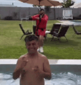

<div align="center">

# 🚨🇨🇱 TÍO RENEEEEEEEEE !!! 🇨🇱🚨
# 😭 ESTOY **LLORANDO** 😭



## **RICOOOOOOOOOOOOOOOOO !!!** 🔥🔥🔥


</div>

---

# 📢 ¡¡¡SEPAN!!! 📢

## **WEON. WEOOOON. ME TIENEN QUE ESCUCHAR.** 😭😭😭

Soy **DANIEL** (o *dvniiel* pa los cabros), estudiante de informática en la **UBB** 🎓 y dev de corazón,
y **NO PUEDO MÁS DE LA EMOCIÓN** CADA VEZ QUE UN `npm install` TERMINA SIN ERRORES.

> ### *"Yo no programo... yo **SUFRO** con estilo."* — Yo, a las 3 AM, con el café frío ☕😭

- 🔭 Ahora mismo: **LLORANDO** con un CRUD que funcionaba ayer. *AYER.* 😭
- 🌱 Aprendiendo: a no hacer `git push --force` a las 4 AM (**no lo he logrado**)
- 💬 Pregúntame de: **JavaScript, Node, React, bases de datos, y cómo sobrevivir a una ayudantía**
- ⚡ Dato freak: una vez centré un `div` al primer intento. **NADIE ME CREYÓ.** 😭🔥

---

# 💪 MIS SKILLS (HITOS DRAMÁTICOS DE MI VIDA) 💪

## ⚛️ **RICOOOOOOOOO EN REACT !!!** 🔥
### Los componentes se renderizan y YO **LLORO DE ALEGRÍA** 😭😭😭

## 🟨 **JAVASCRIPT: MI AMOR, MI CONDENA** 💔
### `undefined is not a function` me persigue en sueños. **AGUANTEN.**

## 🟢 **NODE + EXPRESS: EL BACKEND ME HACE LLORAR** 😭
### ...pero levanto APIs igual. **SEPAN.** 🚀

## 🎨 **LLORO CON LOS BUGS DE CSS** 😭😭😭😭
### `z-index: 999999999;` **Y IGUAL NO SE VE.** ¿POR QUÉEEE?

## 🐍 **PYTHON: EL ÚNICO QUE ME ENTIENDE** 🥹
### Indentación limpia, **CORAZÓN LIMPIO.**

## 🗄️ **BASES DE DATOS: TOCAMOS FONDO** 📉
### Hice un `DELETE` sin `WHERE` una vez. **UNA.** Nunca más. 🕯️

## 📱 **MOBILE / ANDROID: EL EMULADOR ME QUEMÓ EL PC** 🔥💻🔥
### Pero la app corrió. **RICOOOOOOOOOOOOO !!!**

<div align="center">


</div>

---

# 🏆 MIS PROYECTOS (VICTORIAS ÉPICAS Y FRACASOS MONUMENTALES) 🏆

## 🔎 [ObjetosPerdidosUBB](https://github.com/Dvniiel19/ObjetosPerdidosUBB)
### **¿PERDISTE TU POLERÓN EN LA U?** 😭 YO TE LO ENCUENTRO.
Una plataforma pa que la comunidad UBB recupere sus cosas perdidas.
**SALVANDO ESTUCHES DESDE SIEMPRE. TÍO RENEEEEE !!!** 🙌

## 🦁 [ZooAPI-ayudantia](https://github.com/Dvniiel19/ZooAPI-ayudantia)
### **UNA API CON ANIMALES, WEON.** 🐒🦒🐘
Hice endpoints pa un zoológico entero. El león responde `200 OK`. **RICOOOOOOOOO !!!**

## 📋 [Proyecto-Metodologia](https://github.com/Dvniiel19/Proyecto-Metodologia)
### **TOCAMOS FONDO CON ESTE COMMIT... PERO VOLVIMOS MÁS FUERTES** 💪😭
Metodologías ágiles, sprints, dailies y **MUCHAS LÁGRIMAS**. Lo entregamos. **SEPAN.**

## 🧪 [-Clase-2---CRUD-ICINF-IECI-](https://github.com/Dvniiel19/-Clase-2---CRUD-ICINF-IECI-) · [ayudantia1-iws](https://github.com/Dvniiel19/ayudantia1-iws) · [ayudantia3](https://github.com/Dvniiel19/ayudantia3)
### **CREATE. READ. UPDATE. DELETE. LLORAR. REPETIR.** 🔁😭
Ayudantías donde el CRUD me crudeó a mí. **PERO AQUÍ ESTAMOS. AGUANTEN.** 🫡

---

<div align="center">

# 💀 MOMENTO DE SILENCIO POR MIS BUILDS CAÍDOS 💀


```diff
- ERROR: Build failed with 47 errors
- npm ERR! code ERESOLVE
- npm ERR! Could not resolve dependency
- TypeError: Cannot read properties of undefined (reading 'map')
+ ...le borré node_modules y funcionó 😭😭😭
+ RICOOOOOOOOOOOOOOOO !!!
```

### *(yo leyendo mi propio código de hace 2 semanas)* 👆

</div>

---

# 📊 ESTADÍSTICAS QUE ME HACEN LLORAR 📊

| Métrica | Valor | Reacción |
|:---|:---:|:---:|
| ☕ Cafés por semana | **∞** | 😭 |
| 🐛 Bugs creados | **MUCHOS** | 😭😭 |
| 🐛 Bugs arreglados | **ALGUNOS** | 😭😭😭 |
| 🎉 Veces que funcionó al primer intento | **0** | 💀 |
| 🔥 Nivel de rico | **RICOOOOOOOOO** | 🚀🚀🚀 |
| 🇨🇱 Patriotismo | **VIVA CHILE** | 🇨🇱🇨🇱🇨🇱 |

---

<div align="center">

# 📞 CONTÁCTAME (O LLORA CONMIGO) 📞

[](https://github.com/Dvniiel19)

### Si mi código te sirvió: **DEJA UNA ⭐ Y ME HACES LLORAR DE NUEVO** 😭⭐😭

---

# 🇨🇱 ¡¡¡VIVA CHILE!!! 🇨🇱
# **TÍO RENEEEEEEEEEEEEE !!!**
## 😭🔥🚀 **RICOOOOOOOOOOOOOOOOOOOOOO** 🚀🔥😭

<sub>*Este README fue escrito llorando. Si encuentras un typo es porque no veía la pantalla.* 😭</sub>

</div>
